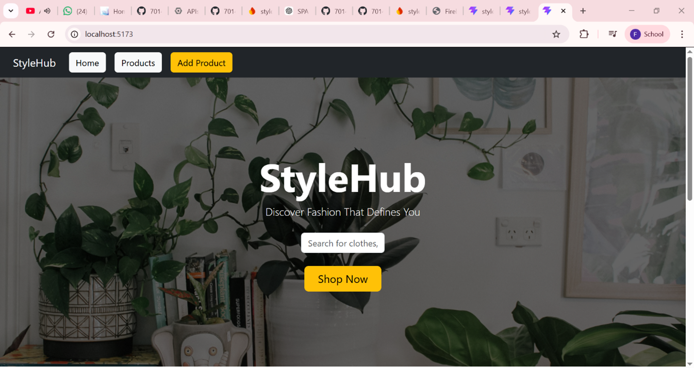
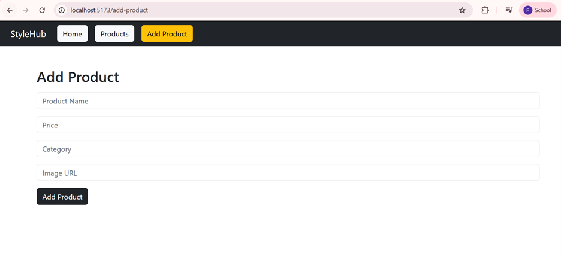
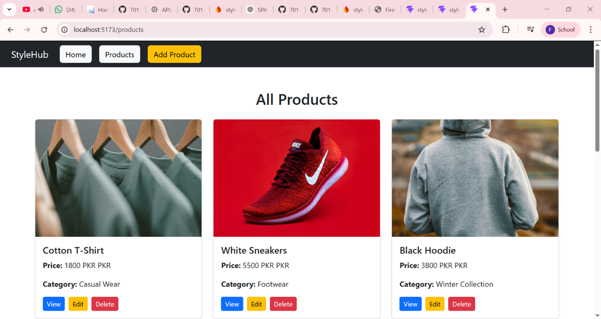
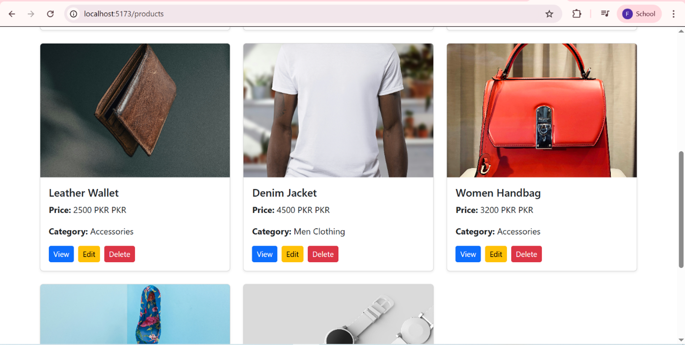
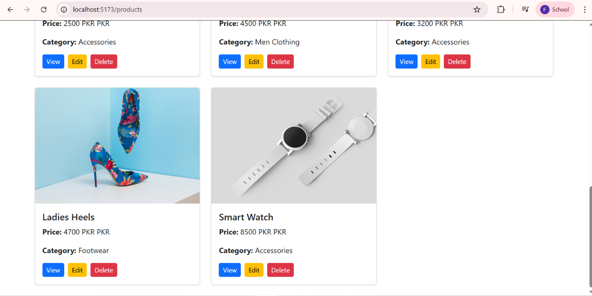
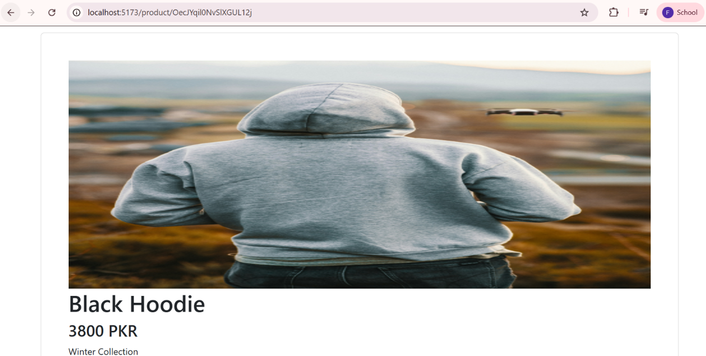
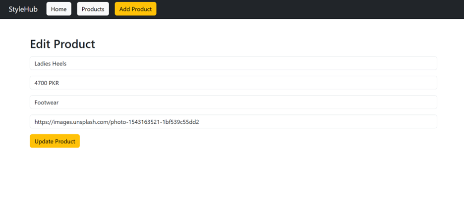
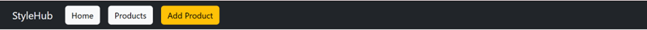
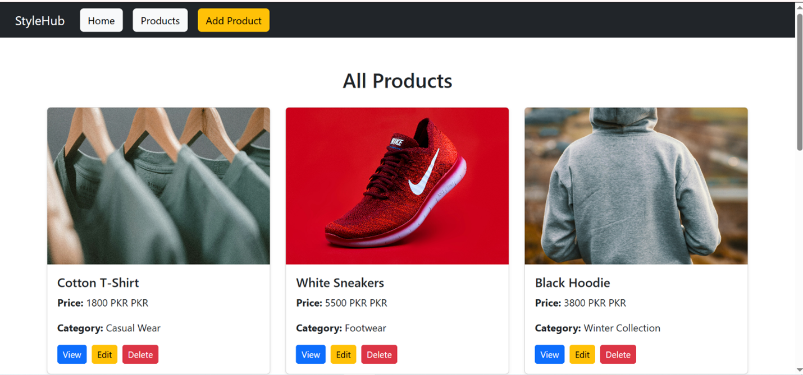

## 📌 Project Description
StyleHub is a Single Page Application (SPA) built using React.js and Firebase Firestore.  
It allows users to perform full CRUD operations (Create, Read, Update, Delete) with dynamic routing and is deployed on Firebase Hosting.
---
## 🚀 Live Project
🔗 https://stylehub-b4039.web.app
---

## 💻 GitHub Repository
🔗 https://github.com/70148555-hue/STYLE.git
---

## ⚙️ Features
- Single Page Application (SPA) using React Router DOM  
- Firebase Firestore integration  
- Create new items  
- View all items (dynamic list)  
- View single item using dynamic route (/item/:id)  
- Update existing items  
- Delete items  
- Responsive UI design  
- Firebase Hosting deployment  

---

## 🧰 Technologies Used
- React.js  
- React Router DOM  
- Firebase Firestore  
- Firebase Hosting  
- JavaScript (ES6+)  
- HTML & CSS / Bootstrap  

---

## 📂 Project Structure
```

src/
├── components/
│    └── Navbar.jsx
├── pages/
│    ├── Home.jsx
│    ├── CreateItem.jsx
│    ├── ViewItems.jsx
│    ├── SingleItem.jsx
│    └── EditItem.jsx
├── firebase/
│    └── firebaseConfig.js
├── App.jsx
└── main.jsx

````

---

## 🔥 CRUD Operations
### Create
- Add new items using form and store in Firestore

### Read
- Display all items from Firestore collection

### Read Single
- Fetch single item using dynamic route `/item/:id`

### Update
- Edit existing item with pre-filled form

### Delete
- Remove item and update UI instantly

---

## 🚀 How to Run Project Locally
```bash
1. Clone repository
git clone https://github.com/70148555-hue/STYLE.git

2. Install dependencies
npm install

3. Run project
npm run dev
````

---

## 📸 Screenshots

(Add your screenshots here in your Word/PDF file)

* Home Page



* Create Page



* View Items Page





* Single Item Page



* Edit Page



* navbar




* repo pages


* Firebase Dashboard

---

## 👨‍💻 Developer

Name: _____MEHRAN AHMAD_____
Roll No: 70148414

---

## 📌 Conclusion

This project demonstrates modern SPA development using React, Firebase Firestore, and deployment using Firebase Hosting.

```

---
